The_Seurat_object\_&\_scRNA_QC
================
Shounak Kadam
2025-10-31

## 🧬 Overview

In this analysis, we perform quality control(QC) on the 10X Genomics
PBMC (Peripheral Blood Mononuclear Cells) single-cell RNA-seq dataset

PBMCs include: - T cells - B cells - NK cells - Monocytes

This dataset is used for QC benchmarking because PBMCs have low RNA
content and represent diverse immune cells

## Goals

1.  Load bulk & single-cell expression data
2.  Create a Seurat object
3.  Compute QC metrics: nCount_RNA, nFeature_RNA, percent_mito
4.  Visualise metrics to identify low-quality cells
5.  Filter low-quality and dying cells

\##Task 1-Part1-Loading tables

``` r
em = read.table("bulk_data/em.csv", header=TRUE,row.names=1,sep="\t")
anno = read.table("bulk_data/annotations.csv",header=TRUE,row.names=1,sep="\t")
de = read.table("bulk_data/de_duct_vs_gut.csv",header=TRUE,row.names=1,sep="\t")
ss = read.table("bulk_data/sample_sheet.csv",header=TRUE,row.names=1,sep="\t")
```

## Create list to store items

``` r
bulk_rna = list("em" = em, "anno" = anno, "de" = de, "ss" = ss)
```

## Inspect list items

``` r
bulk_rna$em
bulk_rna$anno
bulk_rna$de
```

## Add metadata

``` r
assay = "Bulk RNA"
design = "RNA-seq profiling of dendritic cells from mouse gut, lymph duct and node. N=3"
bulk_rna$assay = assay
bulk_rna$design = design 
```

## ➡️Why? To understand data containers before Seurat objects

## Task2: Loading Single-Cell Data

Dataset: ~2700 PBMCs (10X Genomics, healthy donor)

## Install Packages and load libraries

``` r
library(Seurat)
library(ggplot2)
```

## Read matrix from 10x folder or .h5 file

``` r
sc.data=Read10X(data.dir="/Users/shounakkadam/Documents/Module C - Single cell and spatial transcriptomics/sc_data/filtered_feature_bc_matrix")
sc.data=Read10X_h5("/Users/shounakkadam/Documents/Module C - Single cell and spatial transcriptomics/sc_data/filtered_feature_bc_matrix.h5")
```

## Create Seurat Object

``` r
sc.data = CreateSeuratObject(sc.data)
sc.data$orig.ident <- "Control_R1"
```

## 📊Task 3: Exploring Metadata & Raw Counts

``` r
meta.table = data.frame(sc.data@meta.data)
counts.table = data.frame(sc.data@assays$RNA$counts)
```

### Biological Note Single-cell data is sparse - most genes have zero counts per cell PBMCs have ~40kreads/cell, so ~1 read/gene expected

## 📈 Task4: Basic QC Plots

### Reads Per Cell

``` r
ggplot(meta.table, aes(x=nCount_RNA))+geom_histogram()
```

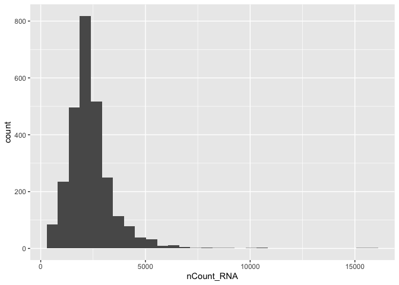<!-- -->

### Genes Per Cell

``` r
ggplot(meta.table, aes(x=nFeature_RNA))+geom_histogram()
```

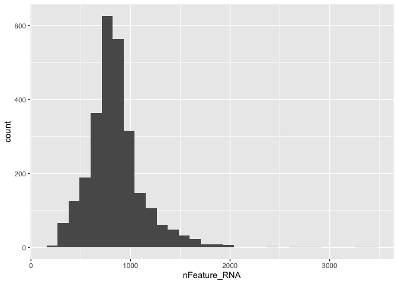<!-- -->

### Reads for one cell(example)

``` r
ggplot(counts.table, aes(x=AAACATACAACCAC.1))+geom_histogram()
```

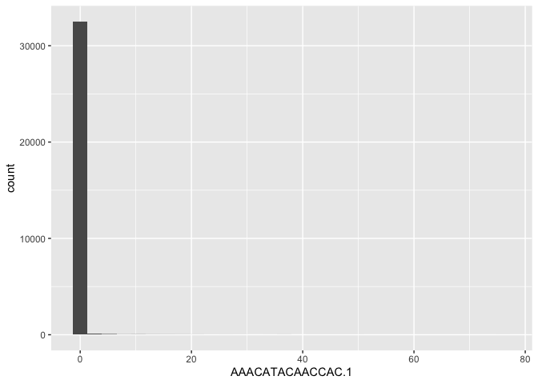<!-- -->

### Interpretation

1.  Low feature count = poor quality/empty droplet
2.  Very high feature count = doublets
3.  PBMCs naturally have fewer genes per cell than tissues

## Task 5: Violin Plots

``` r
VlnPlot(sc.data,features=c("nCount_RNA"),pt.size=0)+NoLegend()
```

    ## Warning: Default search for "data" layer in "RNA" assay yielded no results;
    ## utilizing "counts" layer instead.

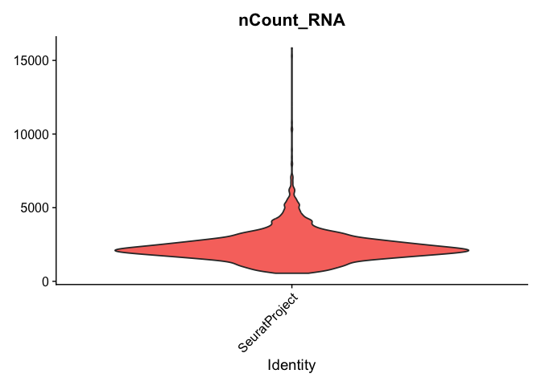<!-- -->

``` r
VlnPlot(sc.data,features=c("nCount_RNA","nFeature_RNA"),pt.size=0)+NoLegend()
```

    ## Warning: Default search for "data" layer in "RNA" assay yielded no results;
    ## utilizing "counts" layer instead.

    ## Warning: annotation$theme is not a valid theme.
    ## Please use `theme()` to construct themes.

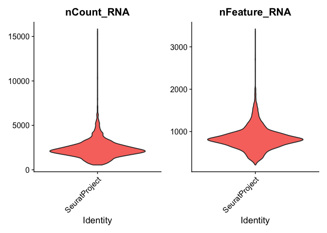<!-- -->

``` r
FeatureScatter(sc.data,feature1="nCount_RNA",feature2="nFeature_RNA")
```

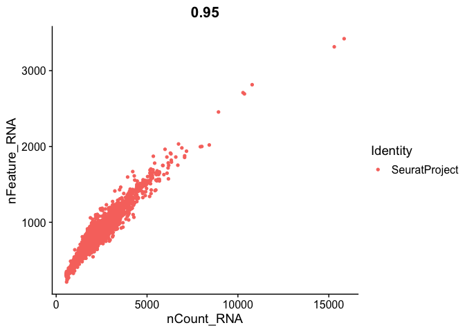<!-- -->

### Interpretation

• Relationship: higher counts = more genes • Outliers indicate doublets
or low-quality cells

## Detecting Mitochondrial Stress/Dead cells

``` r
sc.data=PercentageFeatureSet(sc.data,pattern="^MT-",col.name="percent_mito")
sc.data=PercentageFeatureSet(sc.data,pattern="^ZNF",col.name="percent_znf")
my_genes=c("MALAT1", "ACTB")
sc.data=PercentageFeatureSet(sc.data,features= my_genes,col.name="percent_my_genes")
```

### Biology

High mitochondrial gene percentage = stressed/apoptotic cells dead cells
usually have high mitochondrial gene percentage because of high
transcription rate of mtRNA instead of mRNA • Threshold: \> 5% mito =
remove

### QC Plot with mito%

``` r
VlnPlot(sc.data,features=c("nCount_RNA","nFeature_RNA","percent_mito"),pt.size=0)+NoLegend()
```

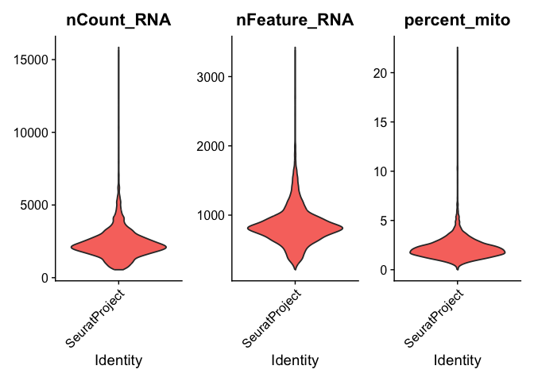<!-- -->

### Scatter: Mito% vs Counts & Genes

``` r
FeatureScatter(sc.data, feature1 = "nCount_RNA", feature2 = "percent_mito")
```

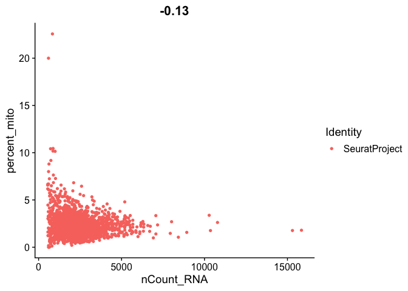<!-- -->

``` r
FeatureScatter(sc.data, feature1 = "nFeature_RNA", feature2 = "percent_mito")
```

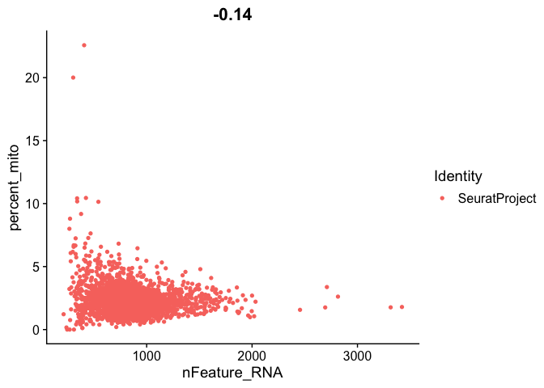<!-- -->
\### Interpretation • Inverse correlation: dying cells = low RNA
counts + high mito % • Consistent with apoptotic PBMC biology

## ✂️Filtering Low-quality cells

``` r
n_before <- ncol(sc.data)
sc.data = subset(sc.data,subset=nFeature_RNA > 200 & nFeature_RNA < 2500 & percent_mito < 5)
n_after <- ncol(sc.data)
c(before = n_before, after = n_after, removed = n_before - n_after)
```

    ##  before   after removed 
    ##    2700    2638      62

## Post QC Visual Check

``` r
VlnPlot(sc.data, features = c("nCount_RNA","nFeature_RNA","percent_mito"), ncol = 3, pt.size = 0.1)
```

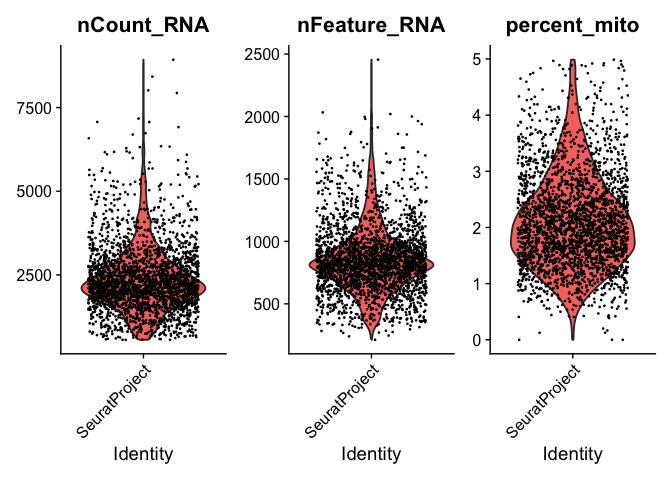<!-- -->

``` r
FeatureScatter(sc.data, feature1 = "nCount_RNA",   feature2 = "percent_mito")
```

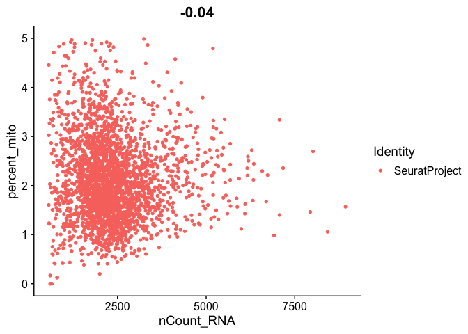<!-- -->

``` r
FeatureScatter(sc.data, feature1 = "nFeature_RNA", feature2 = "percent_mito")
```

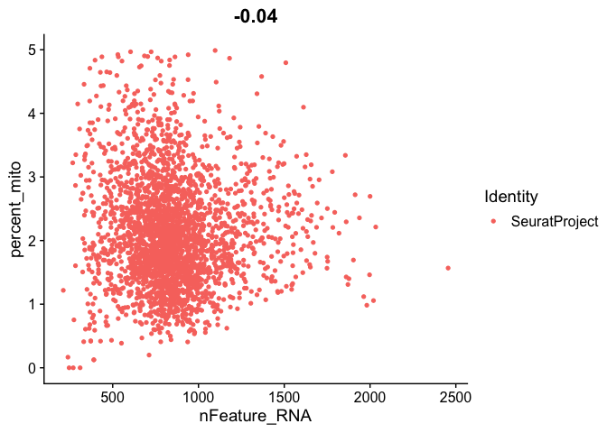<!-- -->

## Interpretation

• Cleaner distribution • Dying cells removed • Dataset ready for
normalization & clustering
