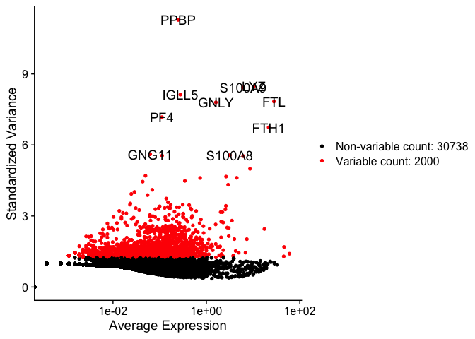
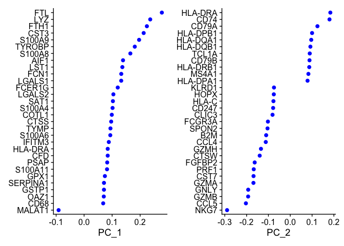
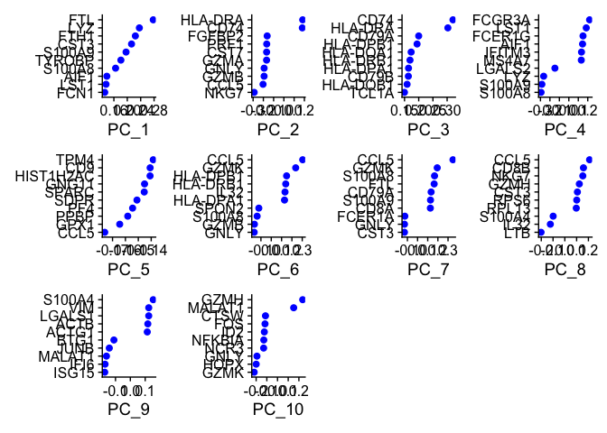
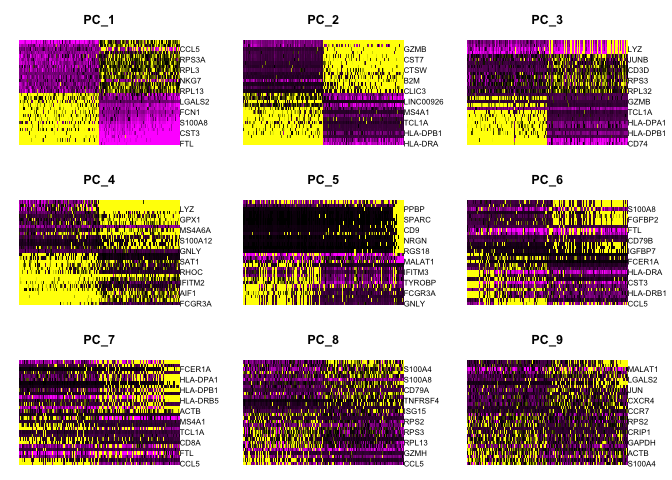
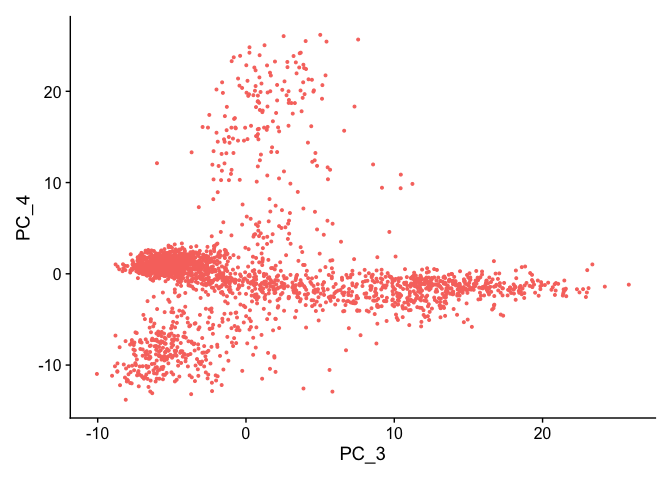
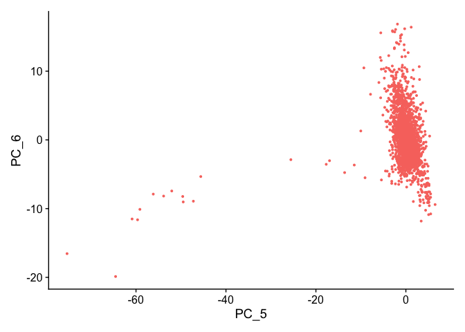

The_Seurat_object\_&\_scRNA_QC
================
Shounak Kadam
2025-10-31

## 🧬 Overview

Single-cell RNA-seq produces expression values for thousands of genes
across thousands of cells.  
At this stage, we don’t yet know what cell types are present - the
dataset is high-dimensional and noisy.

The goal of this session is to:

- **Reduce data complexity** so biological structure becomes visible
- **Group similar cells** based on their expression profiles
- **Identify marker genes** for each emerging group
- **Prepare for cell-type annotation and downstream analysis**

By applying normalisation, PCA, and non-linear embeddings (UMAP/t-SNE),
we transform raw count matrices into a meaningful low-dimensional
representation where cell populations begin to separate.

``` r
library(Seurat)
library(ggplot2)
```

# Load QC Seurat object from Tutorial 1

``` r
sc.data <- readRDS("/Users/shounakkadam/Documents/Module C - Single cell and spatial transcriptomics/bulk_data/outputs/seurat/01_qc_seurat.rds")
```

## Task 1.1 — Normalising (LogNormalize + Scale)

Single-cell RNA-seq raw counts vary greatly across cells due to
sequencing depth differences.  
Before dimensionality reduction, we normalise expression values and
scale them so each gene contributes appropriately to PCA.

**What we do:**

- `NormalizeData()` — log normalises counts to make values comparable
  across cells  
- `ScaleData()` — centers & scales genes (mean=0, variance=1) to prepare
  for PCA

This stores processed values in the **RNA assay** under `data` and
`scale.data`.

``` r
sc.data=NormalizeData(sc.data)
sc.data=ScaleData(sc.data)
```

## Task 1.2 — Identify Highly Variable Genes (HVGs)

After normalisation, not all genes are equally informative - many show
little or no variation across cells.  
We identify **highly variable genes (HVGs)** to focus on biologically
meaningful variation and improve PCA efficiency.

**Why this step matters** - scRNA-seq has thousands of genes → many are
uninformative or noisy  
- HVGs capture true biological differences across cells  
- Reduces computational complexity and improves clustering

We will keep the **top 2,000 most variable genes** using the `vst`
method (default in Seurat).

``` r
sc.data=FindVariableFeatures(sc.data,selection.method="vst",nfeatures=2000)
```

These can be found in the RNA slot. We can see the variable genes with
either:

``` r
variable.genes=VariableFeatures(sc.data)
```

## Task 1.3 - It is also handy to plot the variable genes:

``` r
top10=head(variable.genes, 10)
plot1=VariableFeaturePlot(sc.data)
plot2=LabelPoints(plot=plot1,points=top10,repel=FALSE,xnudge=0,ynudge=0)
plot2
```

<!-- -->

> The red points represent variable genes; black points represent
> non-variable genes.  
> Top variable genes are automatically labelled.

### **Interpretation**

The most variable genes include canonical immune genes such as **S100A8,
S100A9, LST1, PF4, GNLY, NKG7, IGLL5, FTH1 genes**, which are commonly
expressed in immune cell subsets like monocytes, platelets, NK cells,
and B cells.  
This suggests **strong immune flavour**, consistent with PBMC data.

> These genes may act as **cell-type markers**, helping to distinguish
> immune populations later during clustering.

## Task 1.4 - SCTransfrom (Alternative Normalization)

An alternative to the LogNormalize workflow is **SCTransform (SCT)**,
which performs:

- Normalization  
- Scaling  
- Variable feature selection

**in one step** using regularized negative binomial regression.

SCT is often preferred for droplet scRNA-seq (10x PBMCs) because it more
effectively removes technical noise and improves biological signal for
clustering and UMAP.

``` r
sc.data=SCTransform(sc.data, verbose=TRUE, variable.features.n = 3000)
```

## Task 1.5 — SCTransform with Mitochondrial Regression

SCTransform can also regress out technical covariates such as
mitochondrial percentage  
(`percent_mito`). This reduces noise from stressed or dying cells and
improves clustering quality.

``` r
sc.data=SCTransform(sc.data ,vars.to.regress="percent_mito", verbose = TRUE)
```

## Task 1.6 — Check and Set Active Assay

Now that the Seurat object contains multiple assays (`RNA` and `SCT`),  
we must ensure we are working on the correct one for downstream
analysis.

The **active assay** determines which data layers functions like PCA and
UMAP operate on.

``` r
DefaultAssay(sc.data) = "RNA"
DefaultAssay(sc.data) = "SCT"
```

## Task 2 - PCA on SCT assay

``` r
DefaultAssay(sc.data) = "SCT"

sc.data=RunPCA(sc.data, assay = "SCT", npcs = 50, verbose = FALSE)
```

## Task 2.1 - Extract PCA cell embeddings as data frame

``` r
pca_df=as.data.frame(sc.data@reductions$pca@cell.embeddings)
head(pca_df)
```

    ##                         PC_1        PC_2      PC_3       PC_4       PC_5
    ## AAACATACAACCAC-1 -12.7666839  -0.4124357 -6.220166 -0.5210691 -0.4800474
    ## AAACATTGAGCTAC-1 -10.3425777  12.5464010 11.794388 -0.3248571 -0.1736317
    ## AAACATTGATCAGC-1  -5.4901113  -2.6860045 -4.936320  2.4737652 -2.3092865
    ## AAACCGTGCTTCCG-1  26.6989687   1.3710154  2.824256  3.8240925  0.1718053
    ## AAACCGTGTATGCG-1  -0.2698474 -21.6611024 10.244682 -5.0548592  2.7454734
    ## AAACGCACTGGTAC-1  -5.4175817   0.1848489 -3.445014  1.3111897 -1.0652987
    ##                        PC_6       PC_7      PC_8       PC_9      PC_10
    ## AAACATACAACCAC-1  3.8066551  3.2103885  2.934883 -2.0563746 -5.3120169
    ## AAACATTGAGCTAC-1  0.6498506 -2.5240161  2.123428  7.4727775  0.1269686
    ## AAACATTGATCAGC-1  2.7091273 -0.3129347 -9.377579 -3.1828254  1.4655562
    ## AAACCGTGCTTCCG-1  2.5636347 -1.9193064  2.547034 -4.1016531 -1.4444088
    ## AAACCGTGTATGCG-1 -5.9983332 -4.3753105  0.544957 -0.6936494 -1.8881324
    ## AAACGCACTGGTAC-1  0.8643179 -0.8062239 -2.914308  1.3055047  4.3816218
    ##                        PC_11      PC_12       PC_13      PC_14      PC_15
    ## AAACATACAACCAC-1 -1.64376434 -0.9903336 -1.58307996  0.2751136  2.0157020
    ## AAACATTGAGCTAC-1  4.49992460 -2.4006690  0.08115764  1.1234601 -1.2752281
    ## AAACATTGATCAGC-1 -6.08551915  0.3881480  1.07863557 -0.3496569 -1.4920658
    ## AAACCGTGCTTCCG-1  1.16427549 -4.3798367 -0.19602822  0.4459516 -3.9650569
    ## AAACCGTGTATGCG-1 -0.05569348 -1.2496168  0.72241161 -1.6109752 -4.6834107
    ## AAACGCACTGGTAC-1  2.43070195 -0.9700410  0.35846803 -1.8571011 -0.5866401
    ##                        PC_16       PC_17       PC_18     PC_19      PC_20
    ## AAACATACAACCAC-1 -2.61282480 -3.57649039  0.03943797  2.001413 -3.4124701
    ## AAACATTGAGCTAC-1  6.69913965 -1.90470337 -3.84840324  2.384651 -0.2965167
    ## AAACATTGATCAGC-1  1.55200217 -0.31099776  0.94609690  4.471095  0.2178074
    ## AAACCGTGCTTCCG-1 -0.08507966  0.08004106 -3.50299176 -1.493113  2.2918731
    ## AAACCGTGTATGCG-1  3.63433031 -4.86114844  8.29616623  1.859349 -4.1250431
    ## AAACGCACTGGTAC-1  6.22425924  2.38295817  1.06762050 -2.405781 -0.9202450
    ##                       PC_21     PC_22      PC_23        PC_24       PC_25
    ## AAACATACAACCAC-1 -1.3545969 -2.197115  2.5783954 -5.320507733 -4.07905994
    ## AAACATTGAGCTAC-1 -1.0708498 -1.438166  0.4334050  1.271846757 -0.08655479
    ## AAACATTGATCAGC-1 -0.4540468 -1.412108 -2.2611833 -1.073349057  3.33442113
    ## AAACCGTGCTTCCG-1 -2.6264715 -3.058741  1.0372783  0.009124361  0.01442966
    ## AAACCGTGTATGCG-1 -2.5527234 -4.216015 -0.9704967 -0.242666301 -5.38835506
    ## AAACGCACTGGTAC-1  0.8902131 -0.384810  0.5111786  5.180313921  0.00743582
    ##                       PC_26      PC_27       PC_28       PC_29       PC_30
    ## AAACATACAACCAC-1 -1.9702095  0.6388296 -0.99362671  0.04474387  0.35750929
    ## AAACATTGAGCTAC-1  0.1362868  0.4965679 -0.03490662 -1.60303676 -0.02182384
    ## AAACATTGATCAGC-1  0.1321482 -2.0939143 -0.30104985  1.36252121  1.72512096
    ## AAACCGTGCTTCCG-1  2.2435123 -0.3866835  1.85938479  0.31223621 -1.00623357
    ## AAACCGTGTATGCG-1 -4.4294044 -3.5762425 -0.72855671 -3.43195906 -4.91431803
    ## AAACGCACTGGTAC-1 -1.4818637 -2.5485076  3.43760786  0.78306898  0.07903893
    ##                       PC_31      PC_32      PC_33     PC_34     PC_35
    ## AAACATACAACCAC-1 -2.3556713  0.1718141 0.66373697 2.7909054  1.052447
    ## AAACATTGAGCTAC-1  1.6100969 -2.8129020 0.83528209 0.1452226  3.141287
    ## AAACATTGATCAGC-1  0.6300637 -1.5318854 1.73044043 2.8484218  2.678442
    ## AAACCGTGCTTCCG-1 -1.9538920  0.1550294 0.68765793 0.1591216  2.096091
    ## AAACCGTGTATGCG-1 -1.6920177  4.2082566 2.25931077 3.1794145 -3.529167
    ## AAACGCACTGGTAC-1 -3.0023942 -0.7799647 0.09406514 1.7762476 -2.075883
    ##                       PC_36      PC_37      PC_38      PC_39       PC_40
    ## AAACATACAACCAC-1 -1.9431539  0.7269401 -1.0157720  2.8621161  1.26446231
    ## AAACATTGAGCTAC-1 -0.8130128  0.2010094  1.2951694 -1.0563359  4.43711647
    ## AAACATTGATCAGC-1 -0.5234103 -0.7548824 -2.2110188  2.1978231 -0.03240758
    ## AAACCGTGCTTCCG-1 -1.7112272 -2.1016233 -0.8403869 -0.4328792 -0.81615269
    ## AAACCGTGTATGCG-1  5.3395016 -1.0464882 -0.8379938  1.5613426 -1.48638888
    ## AAACGCACTGGTAC-1 -1.5956951 -1.4459335  1.2924109  0.8488861 -1.31099301
    ##                       PC_41      PC_42      PC_43      PC_44      PC_45
    ## AAACATACAACCAC-1  4.8758640 -3.4897252  0.7987537 -1.6810681  1.3258308
    ## AAACATTGAGCTAC-1 -1.5458096 -1.5481404  1.0603102  0.3573743  2.8013667
    ## AAACATTGATCAGC-1 -0.9607456  0.5455527  4.5106653  1.4078016 -0.7491516
    ## AAACCGTGCTTCCG-1  0.1501880 -0.4922895  2.6237094 -1.1197861  3.6771385
    ## AAACCGTGTATGCG-1  2.1653496  1.1654758 -2.1730115 -2.8819117 -2.6669541
    ## AAACGCACTGGTAC-1 -1.7926739  4.8102862 -0.5173864 -0.5940188 -1.4841728
    ##                       PC_46      PC_47      PC_48      PC_49      PC_50
    ## AAACATACAACCAC-1 -1.9841417  1.1322509  0.5222740 -0.6018706  0.3167743
    ## AAACATTGAGCTAC-1  1.2078091 -0.1027807  0.5799406 -1.2227364  1.8587360
    ## AAACATTGATCAGC-1 -1.4612089  0.1291483  1.4203647  0.2499772 -2.1258452
    ## AAACCGTGCTTCCG-1  0.5294266  1.9273870  3.2995999 -0.2518056  2.2192230
    ## AAACCGTGTATGCG-1  0.1403316  1.5363311 -1.5221264  1.1038439 -2.2298470
    ## AAACGCACTGGTAC-1  3.0605311 -2.5712802  2.1065751 -2.9794226  2.3559364

## Task 2.2 — Inspect PCA gene loadings

We can view the genes that contribute most (positively or negatively) to
each principal component.

> `dims` = which PCs to show.  
> `nfeatures` = how many top-loading genes per PC (positive & negative).

``` r
print(sc.data@reductions$pca, dims=1:10, nfeatures=5)
```

    ## PC_ 1 
    ## Positive:  FTL, LYZ, FTH1, CST3, S100A9 
    ## Negative:  MALAT1, RPS27A, CCL5, LTB, RPS6 
    ## PC_ 2 
    ## Positive:  HLA-DRA, CD74, CD79A, HLA-DPB1, HLA-DQA1 
    ## Negative:  NKG7, CCL5, GZMB, GNLY, GZMA 
    ## PC_ 3 
    ## Positive:  CD74, HLA-DRA, CD79A, HLA-DPB1, HLA-DQA1 
    ## Negative:  S100A8, S100A9, LYZ, FTL, RPS12 
    ## PC_ 4 
    ## Positive:  FCGR3A, LST1, FCER1G, AIF1, IFITM3 
    ## Negative:  S100A8, S100A9, LYZ, LGALS2, CD14 
    ## PC_ 5 
    ## Positive:  GNLY, GZMB, FGFBP2, FCGR3A, PRF1 
    ## Negative:  CCL5, GPX1, PPBP, PF4, SDPR 
    ## PC_ 6 
    ## Positive:  CCL5, GZMK, HLA-DPB1, HLA-DRB1, IL32 
    ## Negative:  GNLY, GZMB, S100A8, SPON2, FCGR3A 
    ## PC_ 7 
    ## Positive:  CCL5, GZMK, S100A8, FTL, CD79A 
    ## Negative:  CST3, GNLY, FCER1A, GZMB, HLA-DRB1 
    ## PC_ 8 
    ## Positive:  CCL5, CD8B, NKG7, GZMH, CST3 
    ## Negative:  LTB, IL32, S100A4, B2M, JUN 
    ## PC_ 9 
    ## Positive:  S100A4, VIM, LGALS1, ACTB, ACTG1 
    ## Negative:  ISG15, IFI6, MALAT1, JUNB, BTG1 
    ## PC_ 10 
    ## Positive:  GZMH, MALAT1, CD3D, FGFBP2, FCN1 
    ## Negative:  GZMK, HOPX, GNLY, NCR3, NFKBIA

## Task 2.3 - PCA loadings: which genes drive each PC

# Show top genes driving PC1–PC2

``` r
VizDimLoadings(sc.data, dims=1:2, reduction="pca", nfeatures=30)
```

<!-- -->

# 👉 Modifed to show MORE components but FEWER genes

# Example: PCs 1–10, top 10 genes per PC

``` r
VizDimLoadings(sc.data, dims=1:10, reduction="pca", nfeatures=10)
```

<!-- -->

## Task 2.4 - PCA heatmap across PCs and a subset of cells

# PCs 1–5, sample 500 cells, balance pos/neg loadings

``` r
DimHeatmap(sc.data, dims=1:9, cells=300, balanced = TRUE)
```

<!-- -->

## Task 2.5 - Elbow plot to help decide the maximum useful dimensions.

``` r
ElbowPlot(sc.data, ndims=50)
```

<!-- -->

### Task 2.6 - PC Selection

The elbow plot shows a clear inflection around PCs 10–15, with
diminishing returns beyond ~PC20.  
We therefore selected **PCs 1–20** for UMAP and clustering, capturing
major biological structure without adding noise.

### PCA cell embedding visualization

# PCA dims 1 vs 2

``` r
DimPlot(sc.data, reduction = "pca", dims = c(1, 2)) + NoLegend()
```

<!-- -->

## Additional PCs to inspect sub structure

``` r
DimPlot(sc.data, reduction="pca", dims=c(3,4)) + NoLegend()
```

<!-- -->

``` r
DimPlot(sc.data, reduction="pca", dims=c(5,6)) + NoLegend()
```

<!-- -->

``` r
DimPlot(sc.data, reduction="pca", dims=c(7,8)) + NoLegend()
```

<!-- -->

``` r
DimPlot(sc.data, reduction="pca", dims=c(9,10)) + NoLegend()
```

<!-- -->

## Task 2.7 - UMAP on PCA - we need to further reduce the data.

We want all the data to be represented on only two components. To do so
we use UMAP on the PCA. UMAP tries to further reduce PCA into 2
dimensions

``` r
sc.data=RunUMAP(sc.data,dims=1:20)
DimPlot(sc.data,reduction="umap")
```

<!-- -->

## Why PCA before UMAP?

- **PCA = statistical, linear, faithful.** It captures the main axes of
  biological variation with interpretable components and loadings
  (useful for clustering + inference).
- **UMAP = non-linear, for visualisation.** Great 2D map, but
  distances/areas are *not* statistically meaningful and can be
  distorted by parameters.
- **Computational reason:** running UMAP on all genes/cells is heavy;
  running it on **PCA embeddings** (e.g., PCs 1–20) is fast and stable.
- **Analysis rule:** *Do not* perform statistics on the UMAP layout. Do
  analysis on **normalised data / PCA space**, and use UMAP only to
  **visualise** results.

## Clustering based on PCA

We cluster cells in PCA space because PCA preserves true biological
structure, while UMAP is only for visualization.  
Clustering assigns each cell to a group (`seurat_clusters`) stored in
the metadata.

## Task 2.8 - Graph based clustering

``` r
use.dims= 1:20 # from earlier elbow plot interpretation
sc.data = FindNeighbors(object = sc.data, dims = use.dims)
sc.data = FindClusters(object = sc.data, resolution = 0.5)
```

    ## Modularity Optimizer version 1.3.0 by Ludo Waltman and Nees Jan van Eck
    ## 
    ## Number of nodes: 2638
    ## Number of edges: 99944
    ## 
    ## Running Louvain algorithm...
    ## Maximum modularity in 10 random starts: 0.8841
    ## Number of communities: 9
    ## Elapsed time: 0 seconds

``` r
head(sc.data@meta.data$seurat_clusters)
```

    ## [1] 4 3 0 2 5 0
    ## Levels: 0 1 2 3 4 5 6 7 8

## Task 2.9 - Re-running UMAP which shows a UMAP plot with the cells coloured by assigned clusters

``` r
sc.data = RunUMAP(sc.data,dims = use.dims, min.dist = 0.2, spread = 0.5)
DimPlot(sc.data,reduction="umap",label=TRUE)
```

<!-- -->

## UMAP and clustering interpretation

> After performing PCA-based graph clustering and UMAP embedding, the
> dataset separates into several distinct groups of cells. Each cluster
> represents a transcriptionally similar population, indicating
> meaningful biological structure rather than random variation.

> The use of PCs 1–20 preserved granularity while minimizing noise, and
> a clustering resolution of 0.5 produced clear, well-defined groups.
> Multiple discrete clusters are visible, consistent with expected
> immune cell heterogeneity in PBMC data (e.g., T cells, NK cells, B
> cells, monocytes, platelets). Some clusters show close spatial
> proximity on the UMAP, reflecting related cell types (e.g., T and NK
> cells), whereas others occupy distinct regions, indicating
> transcriptionally divergent populations (e.g., monocytes vs
> lymphocytes).

> UMAP is used only for visualization, and statistical clustering was
> performed in PCA space. The resulting map confirms that the dataset
> contains diverse immune subsets and that the parameters chosen (PCs
> 1–20, resolution = 0.5, min.dist = 0.2) successfully separate
> biologically meaningful cell states.
